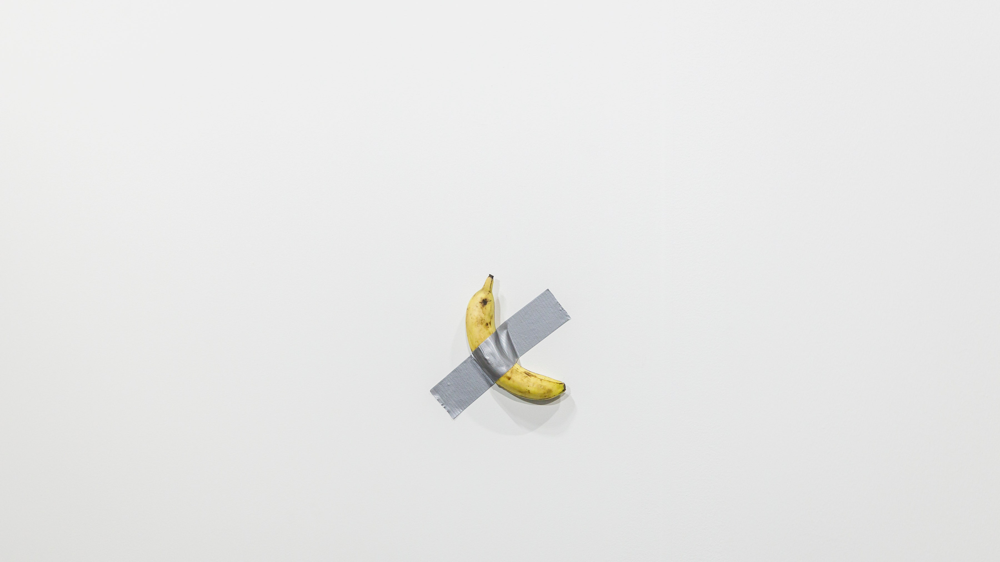

# Modern Art

My problem with modern art that “challenges” the establishment, is the fact the artist never pushes concrete messages in their “statement pieces”. Or beyond them. They are just charades.

That artist who taped the banana to the wall— their name is [Maurizio Cattelan](https://en.wikipedia.org/wiki/Maurizio_Cattelan). He is known for his satirical approach to art. He’s considered a “prankster” in the art world. That’s the extent this criticism reaches— a “joke”.

Imagine an alternate world where this guy isn’t making jokes that sell for $120,000 a banana, but instead purposefully and vocally stands for something. They taped a banana to a wall not because they’re a comedian, but because they’re sick of this pseudo-artistic bullshit artists display on galleries and magnates buy for the purpose of evading taxes (oh yeah, rich people are not getting scammed by artists, pal. The high-art market is just a [fantastic way to avoid taxes](https://www.youtube.com/watch?v=H7V2y76pnBg) and it all depends on art being highly valued).

In this alternate world, the artist tapes a banana to the wall. It sells for $120k. They then openly criticize the fact it sold for $120k. As a statement and to not play into the system, they donate that revenue to art schools and programs for young artists. They speak openly, in interviews and conferences, about how ridiculous this valuation was— but it isn’t comedy, it’s criticism. They keep taping bananas to walls in galleries to purpusefully monetarily devalue the image and concept of the original. They release an open call to all artists to tape a banana to the wall— anyone can do it— as a sign of protest and to raise awareness on the lack of originality in modern art. A banana on a wall goes from being “clever”, “funny” and “high art” to being a symbol of the nefarious tax-evasion heaven the art world has become, and this artist, through their art, becomes a steward of art, standing against its oligarchical corruption.

_*That*_ would be art, because that banana taped to a wall would actually come to mean much more. The fact it sold for $120,000 doesn’t give it value, or make it any more than a banana taped to a wall, because it doesn’t mean it resonates or symbolizes much to a public. The moment it becomes a symbol, and it’s reproduced and recognized, and it becomes charged with meaning, is the moment it actually becomes a valuable art piece— not in monetary, but in symbolic value.

But that’s not what happens back in our world, and we instead live in a world where Maurizio Cattelan is just a “prankster” in the art world— a buffoon whose patrons benefit when he’s on the news with his funny jokes that make them millions, haha, so funny. It’s his job to be in the news, by taping a banana to a wall, or making an 18-karat gold toilet called “America”, but only when Trump wins and so it's ok to shit on America. It’s also his job to never actually provide criticism of value, his patrons don’t want him to rock the boat, he needs to keep up the charade.
