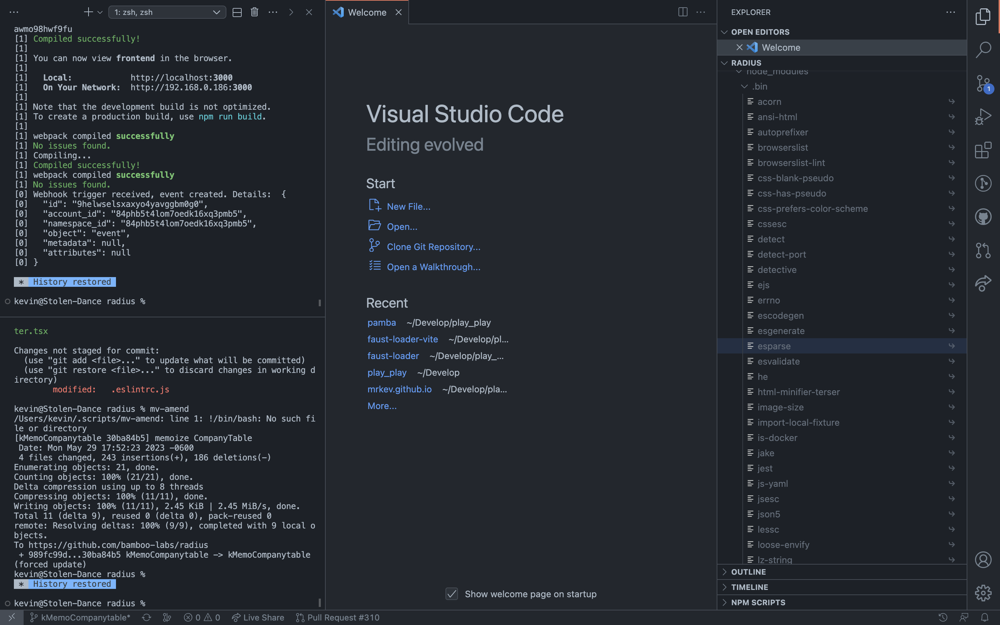

# My VSCode layout

People have casually commented on my VSCode layout before. There’s 2 noticeable things that make it different from what it usually looks like out-of-the-box: the bottom, horizontal panel is instead a column to the left, and I put the sidebar to the right.

## Vertical Terminal

The aspects I like of a vertical terminal are the usual suspects:

- I prefer seeing a lot of history over ensuring text doesn’t wrap
- Likewise, in the code editor, I rather see many lines of text.

A vertical terminal that doesn’t shorten the bottom of my code editor allows both to show more lines. Given most screens are horizontal rectangles, I consider this to be a better use of screen real-estate.

It does become harder to switch between the different tabs of this panel. Notice on the top-left corner, there’s no tabs, as they all have been collapsed to a drop-down menu (…). That’s fine. If all is working smoothly, I almost exclusively only use the Terminal. I occasionally switch to Problems, usually by clicking on the bottom-bar icons displaying error/warning count, and I only use Output when debugging something that might’ve gone wrong with `eslint` or `prettier`, a very rare occurrence.

Moreover, switching back to the Terminal is quick. I use `Cmd+\``, the shortcut to toggle Terminal, often. If this panel is already displaying the Terminal, it toggles hiding and showing it. Very convenient to gain horizontal real-estate.

## Sidebar on the right

It’s perhaps a little bit harder to see the advantages of having the sidebar on the right. The natural choice for a vertical terminal is probably to put it on the right, and keep the sidebar on the left.

A sidebar on the left is a common practice in most other software because it makes sense semantically. The idea is, much like reading is done from left to right, it feels natural to do tasks from left to right. In the case of most apps, this involves increasing specificity as you go right:

- On texting apps (Messenger, Messages, WhatsApp), you start by picking what conversation to look at on the left, and then look at specific messages on the right
- On music apps like Spotify, the containers (playlists) are on the sidebar on the right. You open them to see the contents (songs) for that specific container on the right. Other high-level actions are on the sidebar to the left (Search, Home), and the specific “next steps” after you click them appear on the right.

This is perhaps easiest to see in Finder, where there’s a whole view dedicated to drilling down in specificity, starting on the left with a top-level folder, and going right, drilling ever closer to the specific file you’re looking for:


I don’t care about losing these “specificity” or “container” semantics on VSCode, because this isn’t the mental-model I follow on my day-to-day use of the application. I rarely dig through the filesystem for a file on the sidebar to then view its specific contents. I instead use `Cmd+P` all the time.

Semantically, therefore, my brain thinks of a codebase as a single large container of files. A project folder could have no subdirectories and no sensible file sort order, and it wouldn’t change the way I browse code all that much. Rather than a file location being the the precondition, and the file contents the details, the file content is often I might think of first, and its location is just “another detail”, just “more metadata”, about the file. This flips these “specificity” or “container” semantics on their head. I open files first, and see where they are second. Thus in this sense, by putting the file-browser to the right of the file viewer, I’m still working from left to right.

The only other tabs I use often in this sidebar are “Debug”, which fits this model (first I open the file, then I work my way right to see how its executing), and “Find”, which doesn’t fit this model ¯\\\_(ツ)\_/¯. Using “Find” this way “Find” is not bothersome though.

Lastly, `Cmd+P` means don’t need the sidebar too much. I have the Terminal panel open much more often. `Cmd+B` is easy to press and can toggle the sidebar, and I hide it more often than I hade the terminal to save horizontal space. Having the panel you hide most often hide on the right has 2 advantages:

- Since text is justified left, hiding the left column moves the position of the starting column. Hiding the right column might hide some characters, but if word wrapping is off doesn’t change the position of the text you’re reading. It can be a little jarring to constantly change the spot in space where you start reading.
- Having the right panel open pushes the starting column of text closer the center of the screen. IMO this is more confortable to read than than looking at the left edge of your screen. The closer to the center your text is, the better, especially on wide monitors

Now you know ¯\\\_(ツ)\\\_/¯

## It’s great, trust me

At this point I’m quite used to this layout, and I can only recommend it. It might take some time to get used to it, but if you decide to give it a shot feel free to [let me know](https://twitter.com/intent/tweet?text=@aykev) and I’ll distract you from the weird looks.
