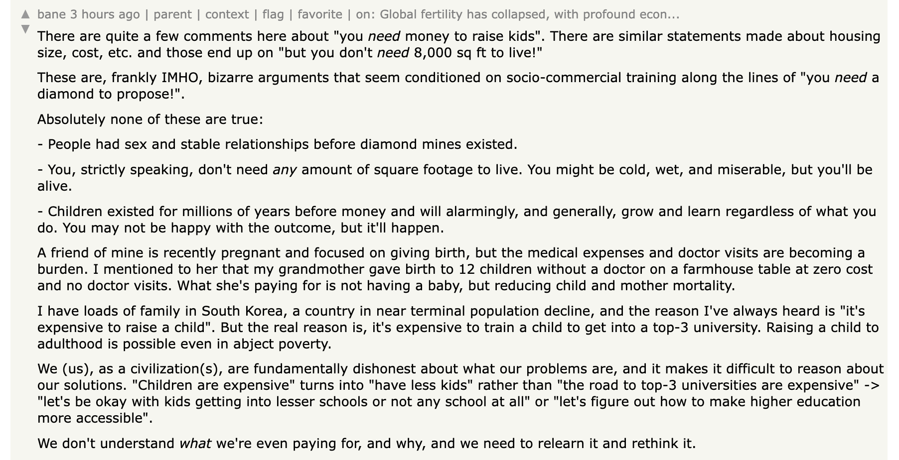

---
modified: 2024-08-10T02:53:51.447Z
---# Birth Rates and Stress

There’s a [thread in Hacker News](https://news.ycombinator.com/item?id=36159936) about global fertility rates, and unsurprisingly a few comments along the line of this one:

It _does_ little bizarre and contradictory that people living in higher levels of poverty have more kids. After all, those of us who live in wealthier countries have all the means to raise children that’ll live a better life.

Although, the more one digs into this last part of the sentence, the more I think one digs at what I believe is source of this discrepancy. What is a “better life”?

I’d attribute this paradox to a common sentiment applied to different standards. I have no reason to believe maternal/paternal love, expressed as the desire that your kids live a _better life_ than you, is a particularly regional or modern idea.

It's heartbreaking to think your child will live a life that's worse than yours. In a poor country, even if you don't have much money, it's easy to think they could do better and live happier life than you. “They could finish school like I couldn’t”. “They could marry older, like circumstances didn’t allow me”. “I got nothing from my parents, but they’ll at least get this shed from me”. “If they work the family farm/business, we’ll all do better”. The steps tend to be clear and relatively straight-forward. In a rich country, even if you have all the means to give them a "good enough" life, it's not as easy to think their life will necessarily be “happier”.

I’d imagine this is why its common to see declining fertility rate not only in countries with large economies, but also in countries or contexts with declining economies. If the economy is growing around a person, an able-bodied kid will just have many more opportunities for a better life. There’s a lot of projects to be done and hope to be had.

It clearly doesn’t have to be this way. If your standard of living is high, your kid could live a similar or even lower standard of living and still be happy. To think otherwise is definitely a cultural issue. It just so happens, rich countries tend to have gotten rich by placing a lot of value in "success", wealth, productivity, and high individual achievement— not in meeting base necessities and being content and grateful with what one has.

The comment above alludes to this, in the context of South Korea:

> But the real reason is, it's expensive to train a child to get into a top-3 university. Raising a child to adulthood is possible even in abject poverty.

I'm not South Korean, but what I've gathered from friends and media is that it's a hyper-capitalist industrial society that's very, very driven by certain ideals of "success”, with high academic, beauty, and wealth standards. There’s [a very famous South Korean YouTuber here in Mexico](https://www.youtube.com/channel/UCL0bN6THhHVBwRPsXKOhAHg), who has often shared her story “failing” in South Korea, suffering intense burn out, medical problems, suicidal thoughts, and finally moving to Mexico to be happier in a society that demands less. It’s very entertaining to see her overflow with happiness enjoying the little things in life: eating cheap fruit, dancing raggaeton, hitting a piñata. I don’t know if she’ll have kids, but it’s seems evident she wouldn’t raise them in Korea, to “have everything” but still suffer the way she did.
